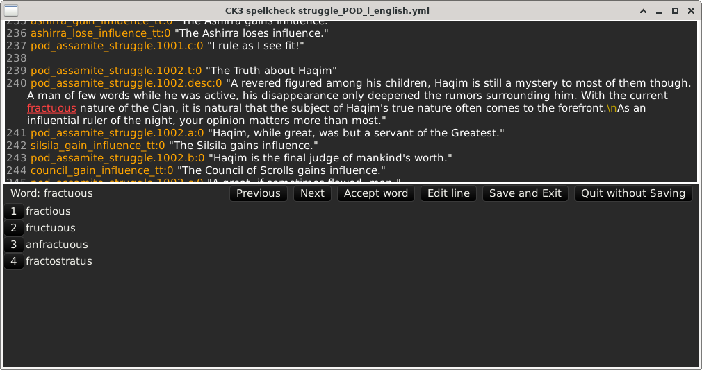

# ck3spell
Spelling checker for Crusader Kings 3 localization files.

It also works for Imperator: Rome.

## Purpose
Localization files for CK3 (Crusader Kings 3) contain the text presented to the user for all the UI elements, in-game events and decisions, etc.
This text often needs to be adjusted depending on the game situation, such as who is involved in an event and which of the involved characters is the player.
Because of that need, the localization texts often contain small blocks of code, such as `[Character.GetCulture.GetName]`, or formatting directives such as `$VALUE|=+0$`.

`ck3spell` is a spelling checker that is optimized for these localization files. It skips the bits of code and other non-text content, and applies its spelling check only to the words that will be shown to the user.

## Screenshot

## Features
* Colors the localization strings to make the user-visible parts easy to recognize
* Uses the correct language from the supported languages for CK3
* Can add words to a permanent local dictionary

## Dependencies
`ck3spell` uses `hunspell` dictionaries but not the `hunspell` library.

### Linux
On Debian and Ubuntu, you should install one or more hunspell dictionary packages depending on which languages you want to check.

The dictionaries are also bundled in the `.tar.gz` release archive, so you only need to install them if you prefer the system ones.

* English: `hunspell-en-us`
* German: `hunspell-de-de`
* Spanish: `hunspell-es`
* French: `hunspell-fr`
* Russian: `hunspell-ru`

`sudo apt install hunspell-en-us hunspell-de-de hunspell-es hunspell-fr hunspell-ru`

### Windows
All the necessary dictionaries are bundled in the `.zip` release archive. As long as you keep them together with the `ck3spell.exe` file, `ck3spell` will find them and use them.

### Development Dependencies
`ck3spell` uses the `GTK-3` library on Linux.

On Debian and Ubuntu, you should install the `libgtk-3-dev` package before compiling `ck3spell`.

`sudo apt install libgtk-3-dev`

## How to use
From the Releases section, download the latest release for your platform.
Either the linux `.tar.gz` or the windows `.zip`.

Unpack it, then go to your mod's directory and do something like

Linux:  <pre>
cd <i>your/mods/directory</i>
<i>path/to/</i>ck3spell localization/english/*.yml
</pre>

Windows, from the command line:  <pre>
CD /D <i>your\mods\directory</i>
<i>path\to\\</i>ck3spell localization\english\\**\\*.yml
</pre>

where the path/to/ is to where you unpacked `ck3spell`, and "english" is whichever language's files you want to spellcheck.

(The `\**\*.yml` pattern after the language selects all localization files, even deep in subdirectories. Linux users can do that too, after setting `shopt -s globstar` (in bash). You can also be more selective and list individual files to check.)

`ck3spell` will show you the files one by one, and each time you click "Save and close" it will show you the next one. You can also use the "Prev" and "Next" buttons at the top to cycle through the files.

Jump to the misspelled words by clicking the "Previous" and "Next" buttons in the central button row. For each word, you can either "Accept word" to accept it as a correctly spelled word, or pick one of the offered corrections from the window below, or "Edit line" to go in and edit that whole line. `ck3spell` always edits one line at a time, because CK3 localization files are based on one line per localization.

Normally "Accept word" only accepts a word for the current spellchecking session. If you want it to remember words long term, you can use the `--local-dict` option, like this:

Linux:  <pre>
<i>path/to/</i>ck3spell --local-dict ck3spell.list localization/english/*.yml
</pre>

Windows:  <pre>
<i>path\to\\</i>ck3spell --local-dict ck3spell.list localization\\english\\**\\*.yml
</pre>

The name `ck3spell.list` can be any filename you like.

## TODO
* Support Korean and Chinese.
* Check words that are part text and part code. Such combination words are important for some languages which use bits of code to get the word endings right. (For example 'luchador'/'luchadora' in Spanish.)
* Support installation and dictionary bundling on Mac.
* Support spellchecking of Imperator:Rome, Hearts of Iron 4, Europa Universalis 4, and Stellaris mods too. Their localization files are very similar.
