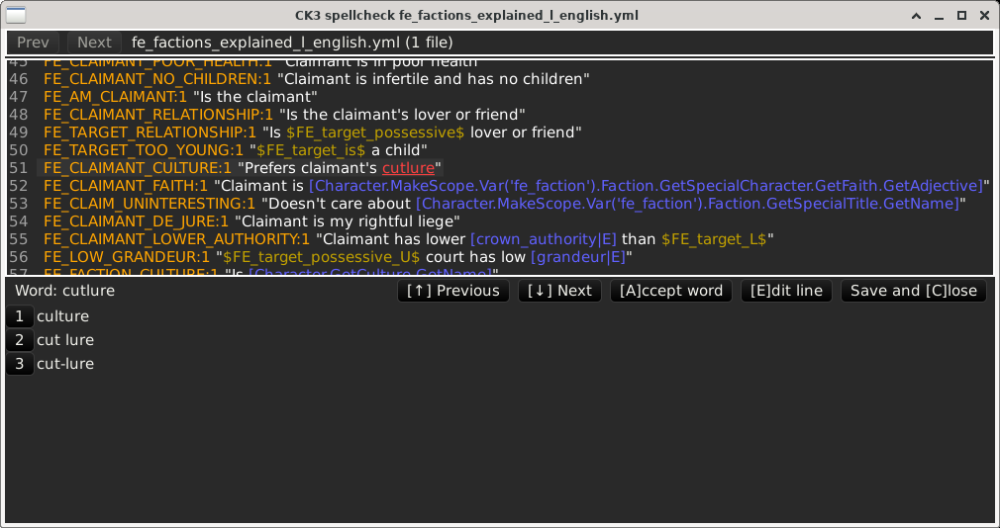

# ck3spell
Spelling checker for Crusader Kings 3 localization files

## Purpose
Localization files for CK3 (Crusader Kings 3) contain the text presented to the user for all the UI elements, in-game events and decisions, etc.
This text often needs to be adjusted depending on the game situation, such as who is involved in an event and which of the involved characters is the player.
Because of that need, the localization texts often contain small blocks of code, such as `[Character.GetCulture.GetName]`, or formatting directives such as `$VALUE|=+0$`.

`ck3spell` is a spelling checker that is optimized for these localization files. It skips the bits of code and other non-text content, and applies its spelling check only to the words that will be shown to the user.

## Screenshot

## Features
* Colors the localization strings to make the user-visible parts easy to recognize
* Uses the correct language from the supported languages for CK3
* Can add words to a permanent local dictionary

## Dependencies
`ck3spell` uses the `hunspell` library.

On Debian and Ubuntu, you should install the `libhunspell-dev` package, and one or more of its dictionary packages depending on which languages you want to check.

* English: `hunspell-en-us`
* German: `hunspell-de-de`
* Spanish: `hunspell-es`
* French: `hunspell-fr`
* Russian: `hunspell-ru`

## TODO
* Support Korean and Chinese.
* Check words that are part text and part code. Such combination words are important for some languages which use bits of code to get the word endings right. (for example 'luchador'/'luchadora' in Spanish).
* Support installation and dictionary bundling on Windows and Mac.
* Provide installable executables.
